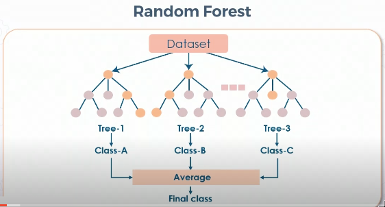

# Definition

## Technique for supervised learning
## Predict class for items 
## Train models with features and known values
## Use trained model to predict

# Common Classification Models
## Logistic Regression
## Decision Tree
## Random Forest
### 
## Naive Bayes
### Each feature of dataset is totally independent of other features
## K-Nearest Neighbor (KNN)
## Stochastic Gradient Descent (SGD)
## Support Vector Machine (SVM)
## Neural Network

# Training steps in Azure
## Create dataset
### Create dataset from files
### View dataset on Explore page
## Create pipeline
### Create pipeline
### Add dataset
## Apply transformations
### Apply transformations before training model
### Use Data Transformation section of Azure ML Studio
## Run pipeline
### Run as an experiment
### Wait for run to complete
## Review transformed data
### Dataset ready for model training
### Select Visualize to review

# Common Evaluation Metrics
## Primary Metrics for Classification Evaluation
### Accuracy
### Precision
### Recall
## Logarithmic loss
## Confusion matrix
## Area under curve
## F1 score
## Mean absolute error
## Mean squared error / Root Mean Squared Error
## Gain and lift charts
## Kolmogorov-Smirnov charts
## Log loss
## Gini coefficient
## Concordant-discordant ratio